## Первая компания ##

  

    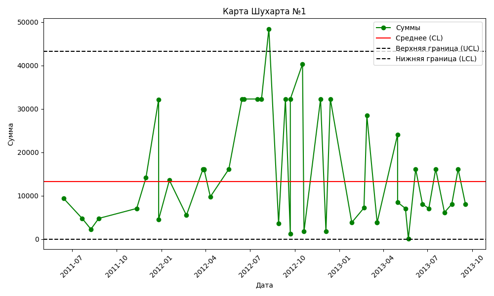
    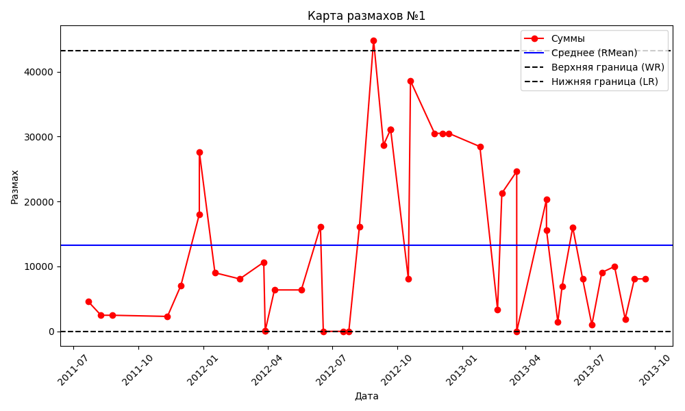
    
В начале периода компания демонстрирует нестабильность (много точек за контрольными границами на R-карте и резкий рост на X-карте). Это может свидетельствовать о проблемах в управлении процессами или о значительных изменениях в условиях.
    После пиковых значений процесс стабилизируется, хотя остаются колебания. Это можно трактовать как движение компании к лояльной категории, поскольку колебания снижаются и размах уменьшается.
    Пиковые значения в 2012 году могут говорить о временных проблемах, таких как сезонные колебания или неустойчивый спрос.
    Итог: Компания постепенно переходит от проблемного состояния к стабильному (лояльному), но всё ещё требуется контроль для предотвращения повторных всплесков и снижения изменчивости процесса.

  

## Вторая компания ##

  

    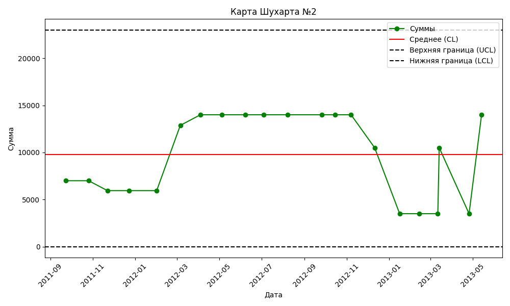
    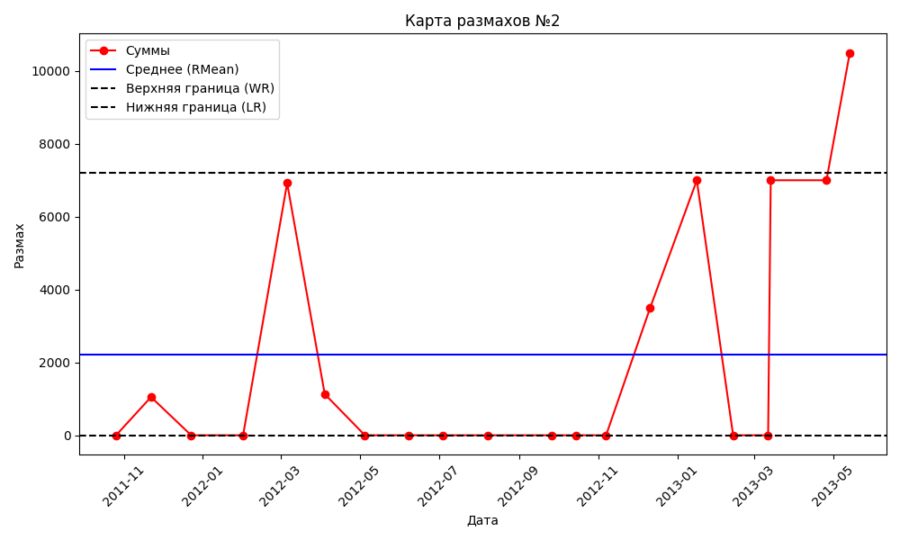
    
Период начала 2012 года: Наблюдается резкий рост и высокая изменчивость процесса, что классифицируется как проблемное состояние. Возможные причины — внешние факторы или изменения в управлении.
    Середина 2012 года: Процесс стабилизируется, что указывает на попытки контроля и урегулирования.
    Начало 2013 года: Снова наблюдается нестабильность, выбросы размахов и резкие изменения суммы, что возвращает компанию в проблемное состояние.
    Середина 2013 года: Процесс вновь стабилизируется, но резкий рост в мае 2013 года указывает на высокую изменчивость.
    Итоговая классификация: Компания находится в проблемном состоянии, с тенденцией к стабилизации, однако присутствуют значительные колебания, что может привести к рискам в будущем. Необходимы дополнительные меры для стабилизации процесса и снижения изменчивости.

  

## Третья компания ##

  

    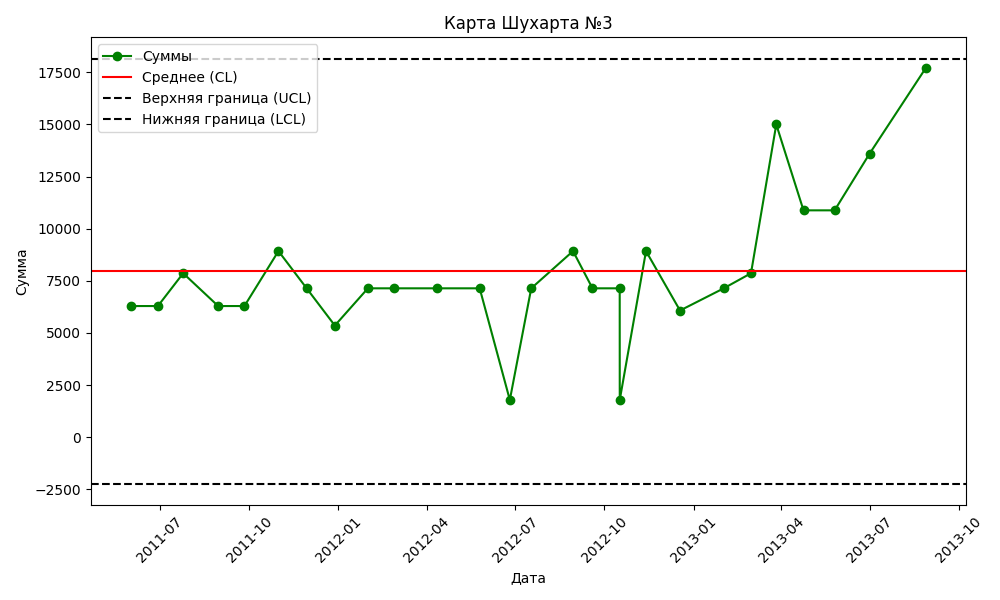
    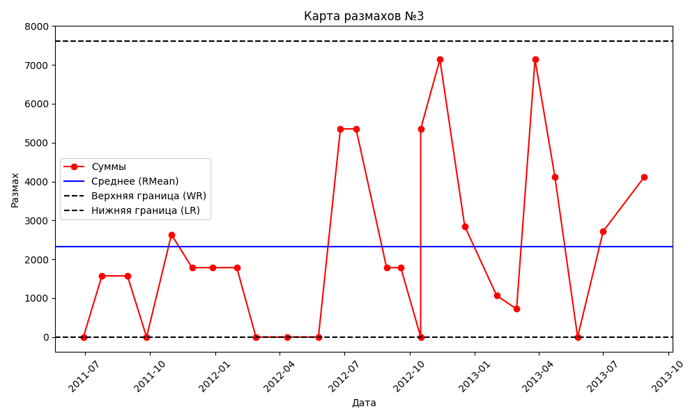
    
Начальный период (2011–2012): Процесс стабилен, находится около средней линии. Компания демонстрирует стабильное состояние.
    Конец 2012 года: Виден спад и увеличение изменчивости, что указывает на проблемное состояние.
    2013 год: Процесс стабилизируется и показывает положительный рост. Это свидетельствует о переходе компании в состояние растущей.
    Итоговая классификация: Компания растущая, так как процесс стабилизировался, и сумма значений демонстрирует положительную динамику. Однако необходимо следить за изменчивостью процесса, чтобы исключить повторное появление проблемных ситуаций.

  

## Четвертая компания ##

  

    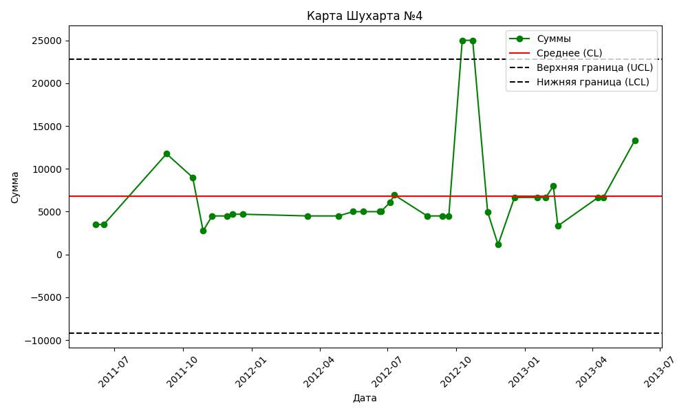
    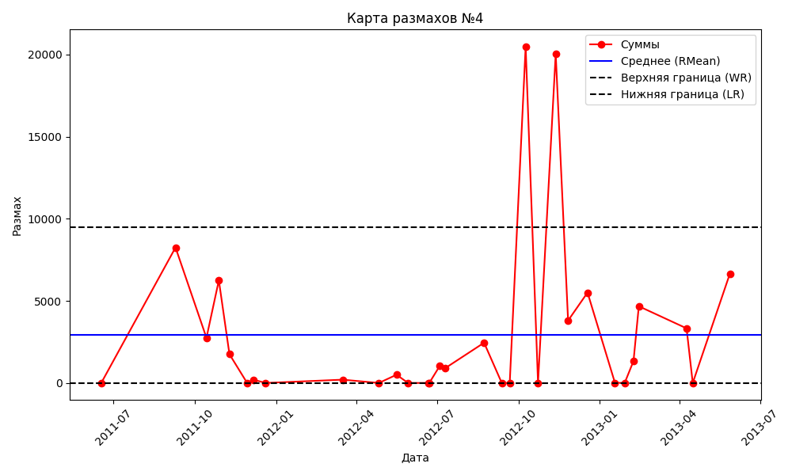
    
Начальный период (2011–2012): Компания находится в стабильном состоянии, несмотря на небольшие колебания суммы.
    Конец 2012 года: Наблюдается значительная нестабильность и выбросы на обеих картах, что классифицируется как проблемное состояние.
    2013 год: Компания демонстрирует признаки восстановления и стабилизации, сумма снова растёт, а размах уменьшается.
    Итоговая классификация: Компания временно находилась в проблемном состоянии, но на данный момент процесс стабилизируется, что позволяет отнести её к категории лояльной с признаками роста. Важно продолжить наблюдение за процессом и исключить повторение значительных выбросов.

  

## Пятая компания ##

  

    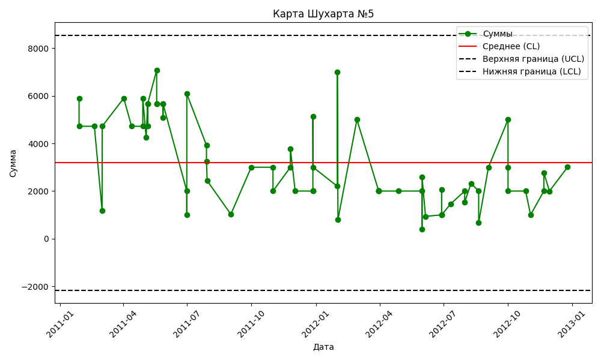
    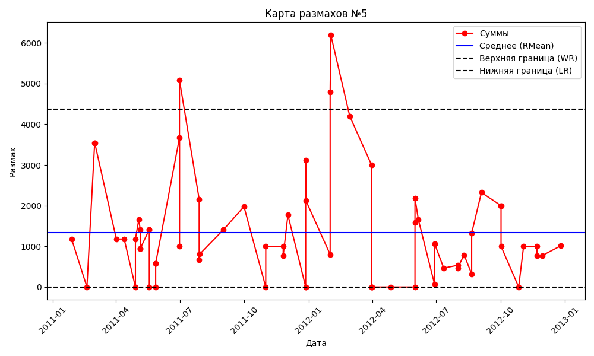
    
Период 2011 года: Компания находится в проблемном состоянии из-за высокой изменчивости и значительных колебаний суммы.
    Период 2012 года и начало 2013 года: Наблюдается стабилизация процесса, снижение изменчивости и нахождение значений суммы в пределах контрольных границ. Это указывает на переход компании в лояльное состояние.
    Итоговая классификация: Компания перешла от проблемного состояния к стабильному лояльному состоянию. Важно поддерживать текущий уровень контроля и стабильности, чтобы не допустить повторных всплесков изменчивости, наблюдаемых в 2011 году.

  

## Шестая компания ##

  

    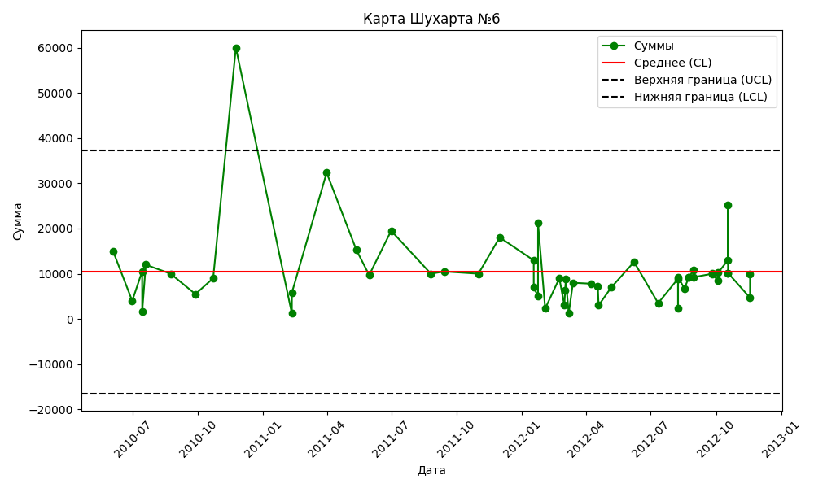
    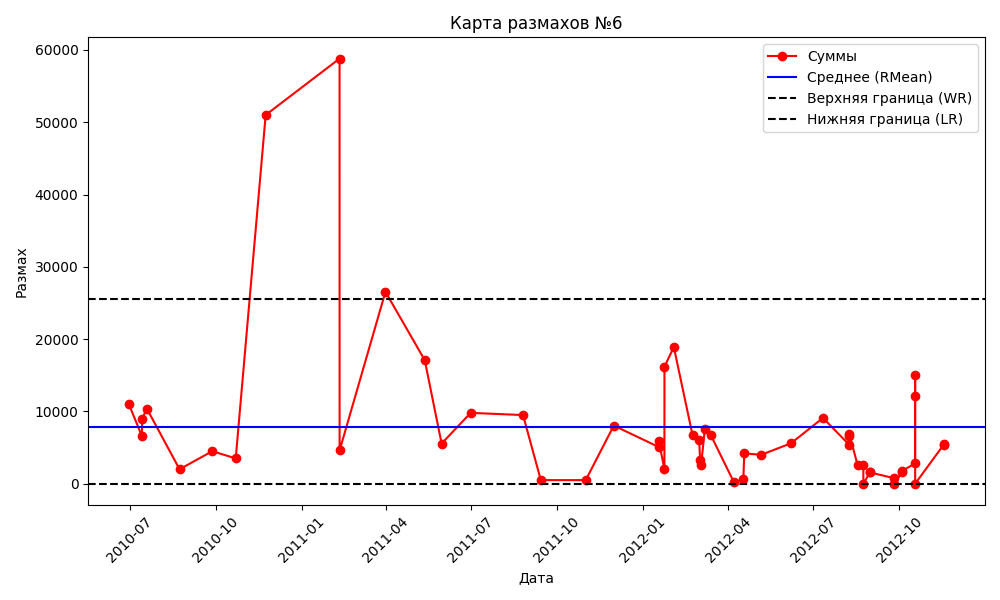
    
Период 2010 года – начало 2011 года: Компания находится в проблемном состоянии, наблюдаются значительные выбросы и высокая изменчивость процесса.
    Период середины 2011 года – 2012 год: Процесс стабилизируется, колебания суммы и размахов уменьшаются, что указывает на лояльное состояние компании.
    Итоговая классификация: Компания стабилизировалась после периода высокой изменчивости и переходит в лояльное состояние. Необходимо продолжать мониторинг процесса, чтобы предотвратить повторные всплески изменчивости, как это наблюдалось в 2010–2011 годах.

  

